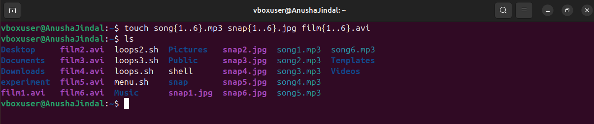
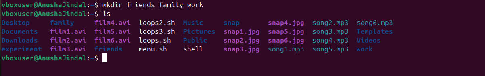
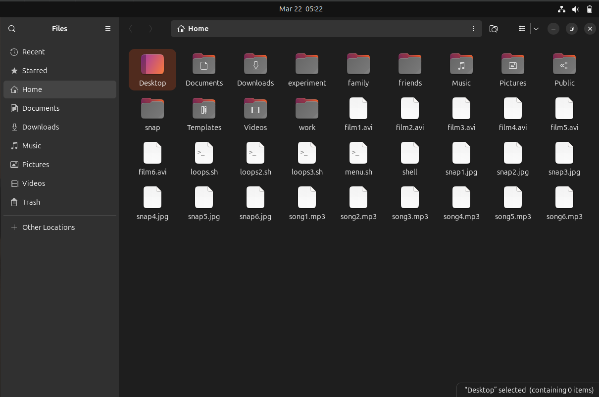

# Lab 1

## 📌 Objective  
Use the touch command to create sets of empty practice files to use during this lab. In each set, replace X with the numbers 1 through 6. Create six files with names of the form songX.mp3, snapX.jpg, filmX.avi and Create three subdirectories for organizing your files, and name the subdirectories friends, family, and work. Use a single command to create all three subdirectories at the same time.

## 🛠️ Steps  

### 1️⃣ **Create the files**  
•	touch Command: The touch command is used to create empty files.

### 2️⃣ **Create the subdirectories**  
•	mkdir Command: The mkdir command is used to create directories 

### 3️⃣  **Output**
