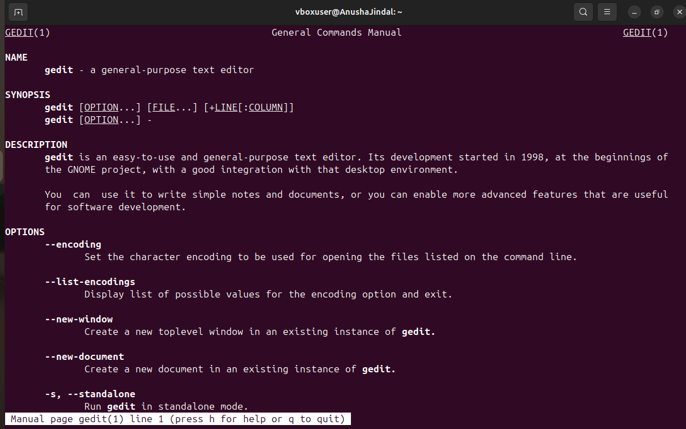
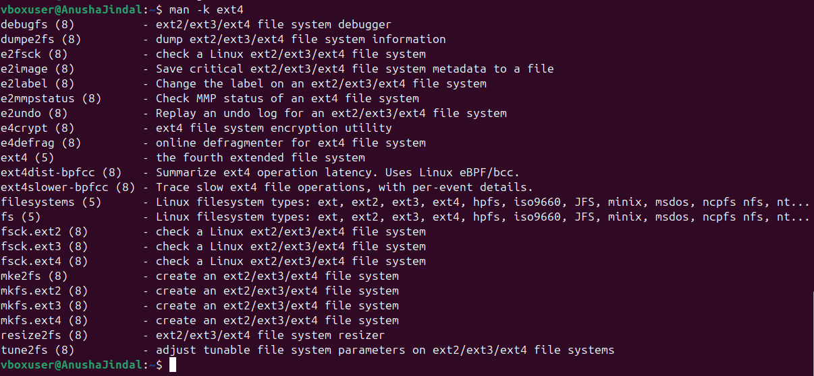
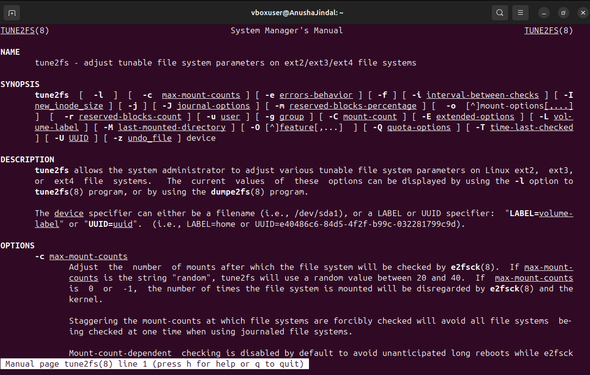
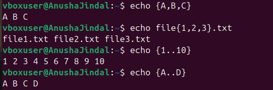

# Lab 2

## 📌 Objective  
View the gedit man page. 
Use the man -k ext4 command to find the command to tune ext4 file-system parameters. 
Brace expansion is used to generate discretionary strings of characters. Braces contain a comma-separated list of strings, or a sequence expression. The result includes the text that precedes or follows the brace definition. 

## 🛠️ Steps  

### 1️⃣ **View the gedit man page**  
To open the manual page for `gedit` :  
 
```bash
man gedit
```
This will display detailed information about the `gedit` text editor, including its options, usage, and examples. 

  

---  
### 2️⃣ **Find the command to tune ext4 file-system parameters**  
Use the `man -k ext4` command to locate the command for tuning ext4 file-system parameters.
 
```bash
man -k ext4
```
This will list all manual pages related to `ext4`. 

 

The command is likely `tune2fs` - it's used to adjust ext4 filesystem parameters.

```bash
man tune2fs
```

 

---  
### 3️⃣ **Brace Expansion**  
Brace expansion generates a sequence of values based on a pattern enclosed in `{}`.

#### **Generate a List of Files**  
```bash
echo file{A,B,C}.txt
```
**Output:** `fileA.txt fileB.txt fileC.txt`

#### **Generate a Numeric Sequence**  
```bash
echo {1..5}
```
**Output:** `1 2 3 4 5`

#### **Generate a Letter Sequence**  
```bash
echo {A..D}
```
**Output:** `A B C D`

 

---  
